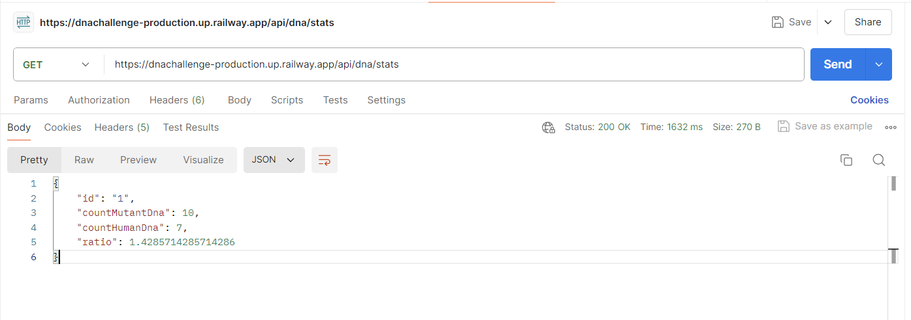
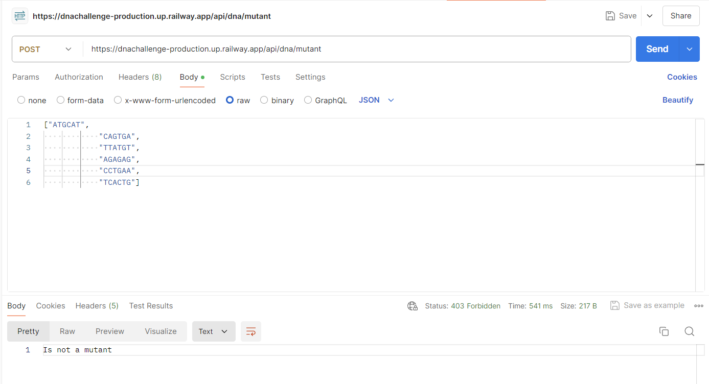
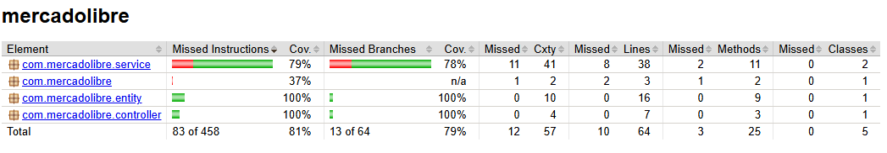

# DNA Challenge

## Descripción 🚀

Este proyecto implementa un desafío relacionado con la validación de secuencias de ADN. La aplicación permite realizar identificar si el ADN es de un mutante o de un humano y guarda los datos en DB para dar el promedio entre mutantes y humanos. Responde a peticiones a través de una API REST.

La aplicación está desplegada en la nube y se puede probar de manera fácil usando Postman.

## Funcionalidades ⚙️

- **/api/dna/stats**: Obtiene las estadísticas de las secuencias de ADN procesadas.
- **/api/dna/mutant**: Valida una secuencia de ADN proporcionada y determina si es mutante.

## URL de la aplicación en la nube 📦

La aplicación está desplegada y disponible para pruebas en Postman utilizando las siguientes URLs:

```bash
https://dnachallenge-production.up.railway.app/api/dna/stats
```

```bash
https://dnachallenge-production.up.railway.app/api/dna/mutant
```


## Pruebas de cobertura 📋

A continuación se muestran las pruebas de cobertura utilizando **Jacoco** para asegurar la calidad del código:



## Instrucciones de uso local

Para ejecutar la aplicación localmente, sigue estos pasos:

1. **Clona el repositorio:**

   Si aún no tienes el repositorio, clónalo en tu máquina local y usa los siguientes comandos:

   ```bash
   git clone https://github.com/asperezm/DNAChallenge.git
   ```
   ```bash
   cd DNAChallenge
   ```
   ```bash
   ./gradlew bootRun
    ```

### Requisitos 🖇️

- JDK 17
- Gradle

